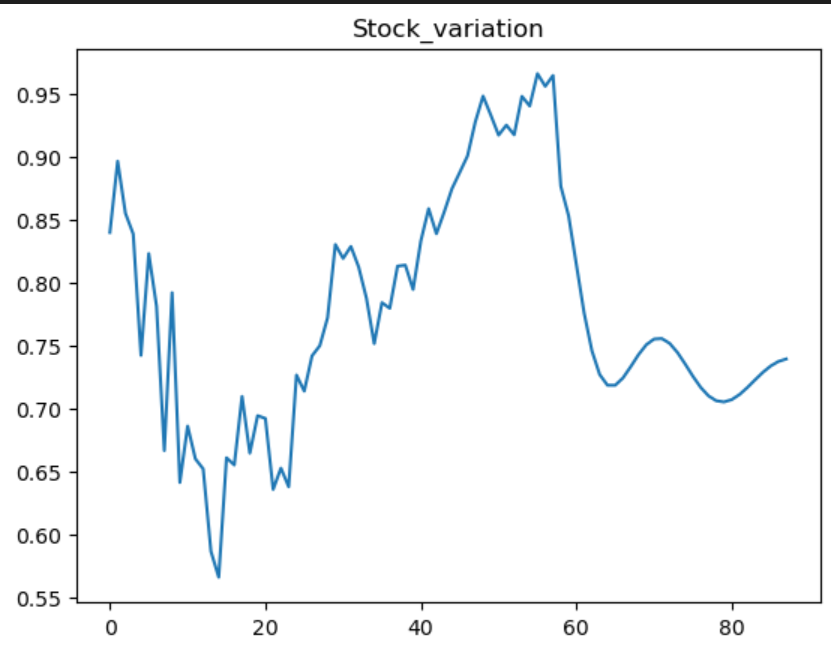

  

# Stock_Price-Prediction-Based-on-Lstm

## **Introduction**
This project implements a Long Short-Term Memory (LSTM) based deep learning model to predict stock prices using historical data. LSTMs are a type of recurrent neural network (RNN) capable of learning long-term dependencies, making them ideal for sequential data such as stock prices.

---

## 🎯 **Objectives**
1.To preprocess and scale historical stock price data.

2.To build an LSTM model for predicting future stock prices.

3.To evaluate the model’s performance using Root Mean Square Error (RMSE).

4.To visualize the results by plotting the original, training, and predicted stock prices.
 

---
## 🏗️**Workflow**
### 1.Data Preprocessing: 
Resetting the index of the data.Scaling the data to a range of [0, 1] using MinMaxScaler.
Splitting the data into training and testing sets.

### 2.Dataset Preparation:
Creating input-output sequences from the data for time-step-based training.Using a time step of 100.

### 3.LSTM Model Architecture:
Four LSTM layers with 50 neurons each.A Dense layer with one neuron for final prediction.
Loss function: Mean Squared Error.
Optimizer: Adam.

### 4.Model Training:
Training the model for 100 epochs with a batch size of 64.Using validation data to monitor performance.

### 5.Evaluation:
Calculating RMSE for both training and testing datasets.

### 6.Visualization:

Plotting the original data, training predictions, and testing predictions.
Extending predictions for the next 30 days and visualizing them.

---

## 📊**Observations**
- The model effectively captures the trends in the stock price data.

- Training and testing RMSE values indicate good predictive performance.

- Future predictions show a reasonable continuation of the observed patterns.

- Visualizations demonstrate the alignment between actual and predicted stock prices.

### Visual Analysis

  
 

---
## 🌟**Conclusion**
This project successfully demonstrates the application of LSTMs in stock price prediction. The model’s ability to predict future prices based on historical data provides a foundation for further enhancements, such as incorporating additional features like trading volume or external market indicators. This project can serve as a baseline for building more sophisticated financial predictive models.
